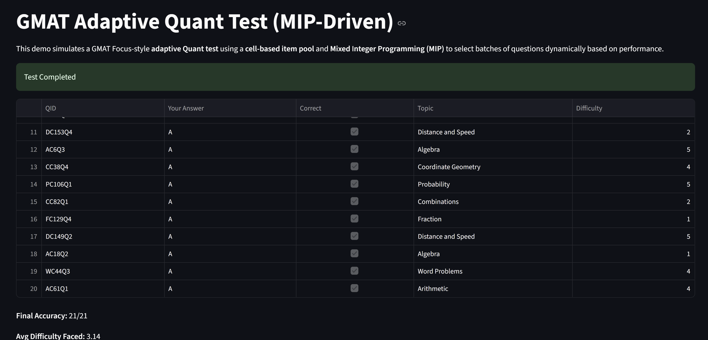

# GMAT Adaptive Test (MIP-Driven)

This is a demo app that simulates a **GMAT Focus Edition-style adaptive Quant test** using a **cell-based item pool** and **Mixed Integer Programming (MIP)** to dynamically select batches of questions based on performance.

Built with **Streamlit**, **PuLP**, **Seaborn**, and **Matplotlib**.

---

## Features

- Cell-based question bank across topics and difficulties
- MIP optimization to pick balanced batches
- Adaptive difficulty adjustment based on user answers
- Dynamic ability tracking (ranging from -2 to +2)
- Heatmap and visual analytics at the end
- No repetition of past attempted questions or recently used cells

---

## Demo Screenshot




---

## ✨ Before You Begin

Make sure Python is installed on your system.

### 🔍 How to check:

Open Terminal (Mac) or Command Prompt (Windows) and type:

```bash
python --version
```

If Python is **not installed**, follow these instructions:

### ✅ Install Python 3.11+

- **Windows:**

  1. Go to: [https://www.python.org/downloads/windows/](https://www.python.org/downloads/windows/)
  2. Download Python 3.x Installer.
  3. Run it and check the box **"Add Python to PATH"** before clicking Install.

- **Mac:**
  1. The easiest way is using Homebrew. First install [Homebrew](https://brew.sh), then:
     ```bash
     brew install python
     ```

Once installed, run:

```bash
python --version
```

You should see something like `Python 3.11.x`.

---

## 🛠 Installation Instructions

### 1. Clone the repository

```bash
git clone https://github.com/harshrumalwala/gmat-adaptive-test.git
cd gmat-adaptive-test
```

### 2. Create a virtual environment (recommended)

#### Mac/Linux:

```bash
python -m venv venv
source venv/bin/activate
```

#### Windows:

```bash
python -m venv venv
venv\Scripts\activate
```

### 3. Install dependencies

```bash
pip install -r requirements.txt
```

### 4. Run the app locally

```bash
streamlit run quantTestDemo.py
```

Your browser will automatically open the interactive GMAT Quant test UI.
Correct answer for all questions is "A".

---

## 📟 Requirements

These will be auto-installed via `requirements.txt`:

```
streamlit
pulp
pandas
matplotlib
seaborn
```

---

## 📁 File Structure

```
.
├── quantTestDemo.py        # Main adaptive test logic and UI
├── requirements.txt        # Dependency list
├── README.md               # You're reading this
└── demo.png                # Screenshot preview (optional)
```

---

## 🤔 FAQ

### How does difficulty adapt?

- After each block of 3 questions:

  - ✅ >80% correct → ability +1
  - ❌ 30-80% correct → ability stays same
  - ❌ <30% correct → ability -1

- The ability score then sets the **target difficulty** of the next block (range: 1–5).

### How are questions selected?

- A Mixed Integer Program (MIP) chooses questions that:
  - Match the target difficulty (with margin)
  - Avoid repeat topics or recently used cells
  - Prefer underrepresented topics and less-used items

---

## 👤 Author

Created by Harsh Rumalwala  
Feel free to **fork**, **star**, or **share**!

---

## 📄 License

MIT
